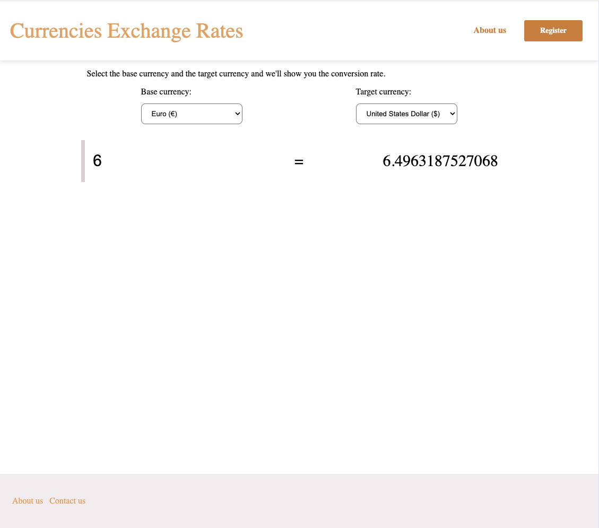

# Exchange rate app

## Introduction

With this exchange rate app you can convert different currencies from one to another. The currencies available in this app are the United States dollar, euro, Canadian dollar, Indian rupee and Nepalese rupee.

## Languages

In this app TypeScript, HTML and CSS are used.

## How to use the app

1. Clone the repository:
   `git clone https://github.com/satuhalinen/exchange-rate-app-typescript.git`
2. Run the following command: `npm install`
3. Sign up here: https://www.exchangerate-api.com.
4. Get your API key.
5. Make a separate file called key.ts into src folder and define your key in the file like this: `const YOUR_API_KEY: string= "...";`
6. Run the following command: `npm run dev`

## Visuals

